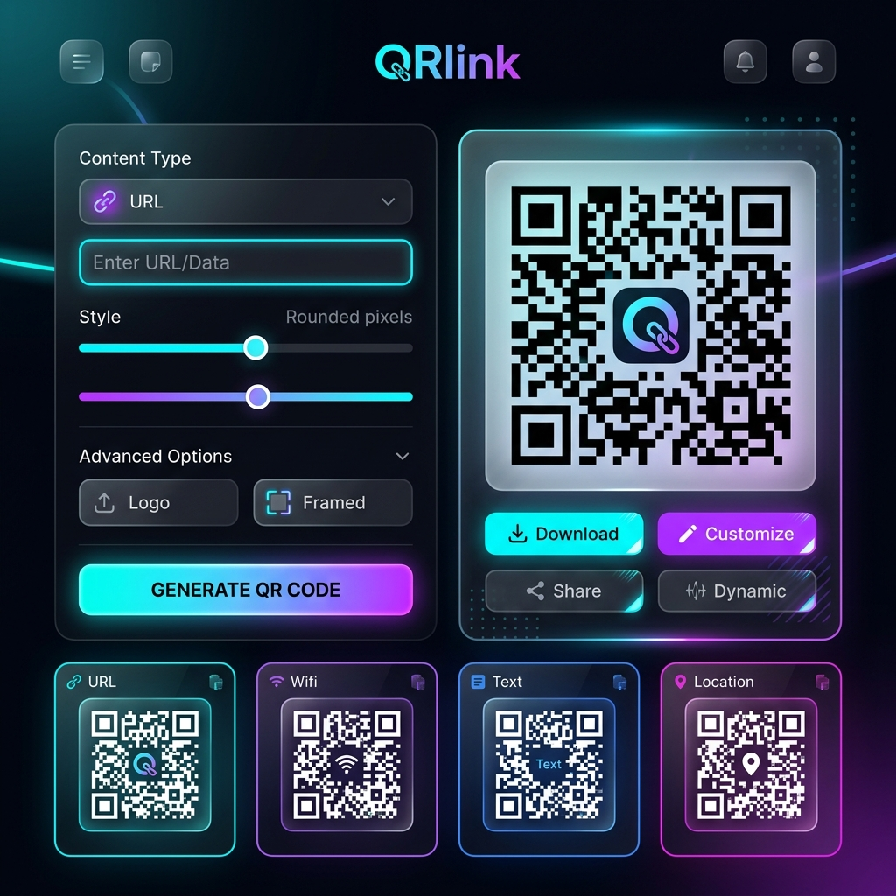

# QRlink — NEXUS Premium QR Generator

<div align="center">
  
  <br><br>
  <p>
    
    
    
  </p>
  <p align="center">
    <b>A professional, high-performance QR code generator built for the modern web.</b><br>
    Experience a premium interface with real-time customization and massive batch processing capabilities.
  </p>
</div>

---

## ⚡ Overview

**QRlink** is a sleek, web-based QR code engine featuring the **NEXUS design system**. It combines a minimalist aesthetic with powerful functionality, allowing users to create high-resolution, stylized QR codes for personal or professional use.

Designed with a focus on **UX aesthetics**, QRlink features smooth glassmorphism, animated background orbs, and a highly responsive layout optimized for both desktop and mobile users.

---

## ✨ Key Features

### 🔵 Single Mode (Real-Time Precision)
- **Instant Live Preview**: Every adjustment is reflected immediately on the canvas.
- **Advanced Customization**: 
  - **Dot Styles**: Choose from *Rounded*, *Extra-Rounded*, *Classy*, *Dots*, or *Square*.
  - **Color Control**: Full control over foreground (dots) and background colors.
- **High-Res Exports**: Download as **2000x2000px PNG** (print quality) or scalable **SVG** vectors.

### 🟣 Batch Processor (Efficiency at Scale)
- **Massive Throughput**: Generate up to **50 QR codes** in a single session.
- **Bento Grid View**: Monitor all generated codes in a beautiful, modern grid layout.
- **ZIP Archive Export**: Package all your QR codes into a single, organized `.zip` file with one click.

### 📱 Premium Experience
- **Mobile-First Navigation**: A dedicated bottom navigation bar for seamless mobile use.
- **Cyber-Modern Aesthetic**: Noise overlays, glowing orbs, and premium typography (Outfit & Inter).
- **Fast & Lightweight**: No heavy frameworks—built with pure, optimized Vanilla JS and CSS.

---

## 🛠️ Technical Stack

- **Frontend Core**: Vanilla JS (ES6+), Semantic HTML5, CSS3.
- **QR Engine**: [qr-code-styling](https://github.com/kozakdenyz/qr-code-styling) (v1.6.0-rc.1).
- **Compression**: [JSZip](https://stuk.github.io/jszip/) for batch packaging.
- **File Management**: [FileSaver.js](https://github.com/eligrey/FileSaver.js/) for seamless downloads.
- **Aesthetics**: Google Material Symbols & Google Fonts (Outfit, Inter).

---

## 🚀 Getting Started

### Prerequisites
No complex installation required—just a modern web browser.

### Installation
1. **Clone the repository**:
   ```bash
   git clone https://github.com/almus-06/project-QRlink.git
   cd project-QRlink
   ```
2. **Launch**:
   Simply open `index.html` in your browser.
   
   *Or use a local server for better performance:*
   ```bash
   npx serve .
   ```

---

## 🗺️ Roadmap & Progress

- [x] **Dual-Mode Architecture**: Seamlessly switch between Single and Batch modes.
- [x] **NEXUS UI Overhaul**: Implementation of the premium dark-mode design system.
- [x] **ZIP Export System**: Reliable batch processing and archiving logic.
- [x] **Vector Support**: High-resolution SVG export for professional design.
- [ ] **PWA Integration**: Offline support and app-like installation.
- [ ] **Logo Overlays**: Support for custom branding inside the QR code center.
- [ ] **Custom Shapes**: Support for non-standard QR shapes and frames.

---

<div align="center">
  <p>Developed with ❤️ for the community by <b>QRlink Team</b></p>
</div>
